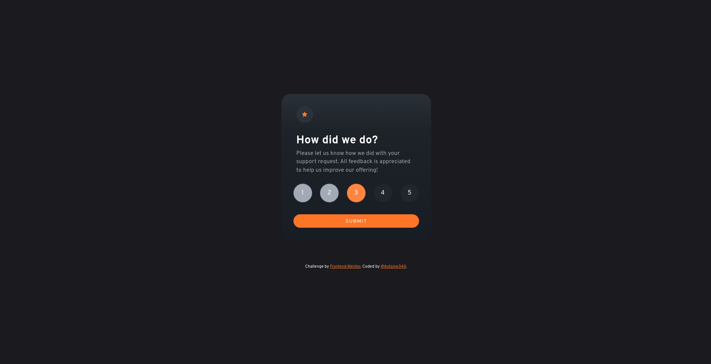

# Frontend Mentor - Results summary component solution

This is a solution to the [Interactive Rating component challenge on Frontend Mentor](https://www.frontendmentor.io/challenges/interactive-rating-component-koxpeBUmI/). Frontend Mentor challenges help you improve your coding skills by building realistic projects.

## Table of contents

- [Overview](#overview)
   - [The challenge](#the-challenge)
   - [Screenshot](#screenshot)
   - [Links](#links)
- [Built with](#built-with)

## Overview

### The challenge


### Links

- Solution URL: [https://effortless-gelato-738bfe.netlify.app/](https://effortless-gelato-738bfe.netlify.app/)

## Built with

- Vue 3
- Vite
- Vuetify 3
- TypeScript
- SASS

## What I learned

I learned how to use the v-item-group (vuetify) component and how to customize it.

```html
 <v-item-group
        v-model="rating"
        class="d-flex mb-8 w-100 justify-space-between rating"
>
  <v-item
          v-for="n in 5"
          :key="n"
  >
    <template #default="{ toggle }">
      <v-btn
              :active="rating != null && rating + 1 >= n"
              color="hsl(217, 12%, 100%)"
              border
              icon
              height="50"
              width="50"
              class="rating-btn"
              @click="toggle"
      >
        {{ n }}
      </v-btn>
    </template>
  </v-item>
</v-item-group>
```

Also learned how to select last element of a class with css.

```css
.rating {
  .v-btn--active {
    background-color: hsl(217, 12%, 63%)!important;
    &:nth-last-child(1 of .v-btn--active) {
      background-color: hsl(25, 97%, 53%)!important;
    }
  }
  &-btn {
    background-color: hsl(210, 16%, 15%) !important;
    &:hover {
      background-color: hsl(217, 12%, 63%)!important;
    }
  }
}
```

## Author

- Frontend Mentor - [@Antoine340](https://www.frontendmentor.io/profile/Antoine340)
- Linkedin - [@Antoine](https://www.linkedin.com/in/antoine-chauvin-994642124/)
